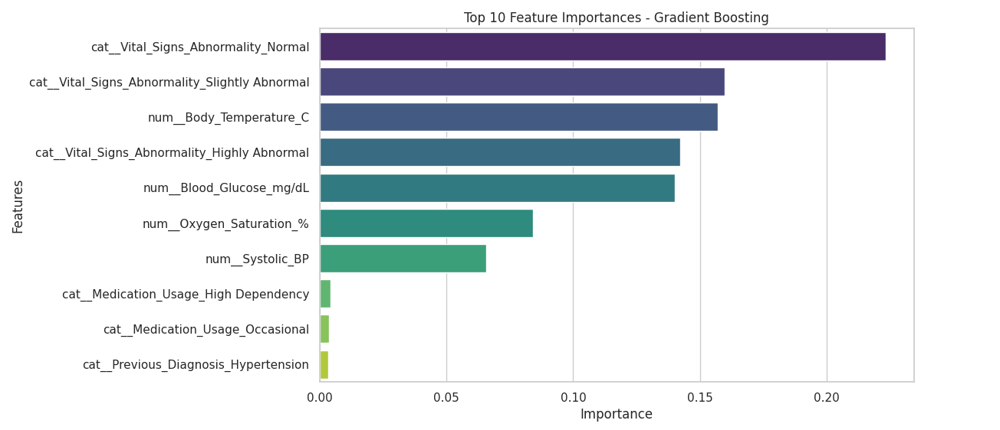
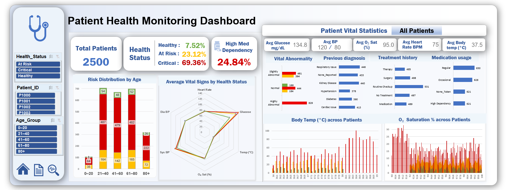

# 🩺 IoMT Healthcare Risk Prediction (Excel + Python)

The project demonstrates how **data-driven IoMT analytics** can improve early risk detection and patient monitoring.  
By integrating **Python’s analytical power** with **Excel’s visualization capabilities**, it bridges technical modeling with actionable business insights in healthcare informatics.

---

## 📘 Overview  
The **IoMT Healthcare Monitoring and Security Dataset** represents real-world **Internet of Medical Things (IoMT)** environments where patient data is collected through interconnected medical sensors.  
This project focuses on **predicting patient health status** and analyzing the physiological and behavioral factors contributing to health risk levels.  

It combines **Excel-based data analysis and dashboarding** with **Python-based machine learning modeling**, offering both analytical and visual insights into patient health dynamics.

---

## 📊 Dataset  

- **Source:** IoMT Healthcare Monitoring and Security Dataset - https://www.kaggle.com/datasets/zyan1999/iomt-healthcare-monitoring-and-security-dataset  
- **Records:** 2,500 patient entries  
- **Objective:** Classify patients as **Healthy**, **At Risk**, or **Critical** based on vital signs, medical history, and treatment patterns.  

| Feature | Description |
|----------|--------------|
| **Patient_ID** | Unique identifier assigned to each patient record |
| **Patient_Age** | Age of the patient (18–90 years) |
| **Vital_Signs_Abnormality** | Overall condition of vital signs — Normal / Slightly Abnormal / Highly Abnormal |
| **Previous_Diagnosis** | Previously diagnosed condition: Diabetes, Hypertension, Cardiac Issue, etc. |
| **Medication_Usage** | Medication intake level — None / Occasional / Regular / High Dependency |
| **Treatment_History** | Past medical treatment — No Treatment / Routine Checkup / Medication / Surgery / Therapy |
| **Heart_Rate_BPM** | Heart rate in beats per minute (50–110 BPM) |
| **Blood_Pressure_mmHg** | Blood pressure reading in Systolic/Diastolic format (e.g., 120/80 mmHg) |
| **Oxygen_Saturation_%** | Oxygen saturation level in blood (90–100%) |
| **Body_Temperature_C** | Body temperature in Celsius (36.0–39.0°C) |
| **Blood_Glucose_mg/dL** | Blood glucose level (70–200 mg/dL) |
| **Health_Status (Target)** | Health classification: Healthy / At Risk / Critical |

---

## 🧰 Tools & Technologies  

| Category | Tools Used |
|-----------|-------------|
| **Programming Language** | Python |
| **Libraries** | pandas, numpy, matplotlib, seaborn, scikit-learn | Gradio for interactive interface
| **Visualization & Dashboard** | Microsoft Excel |
| **Presentation** | Microsoft PowerPoint |
| **IDE** | Jupyter Notebook / Google Colab |

---

## 🔍 Project Workflow  

### 1️⃣ Data Importing  
- Reviewed structure, data types, and missing values.  

### 2️⃣ Data Preprocessing  
- Cleaned and formatted both numeric and categorical variables.  
- Handled missing or invalid values.  
- Standardized vital signs and combined systolic/diastolic BP readings.  
- Encoded categorical columns and normalized numeric features.  

### 3️⃣ Exploratory Data Analysis (EDA)  
- Conducted descriptive and statistical analysis to compare vitals and identify key health risk indicators.

### 4️⃣ Feature Engineering & Selection  
- Selected relevant variables
- Removed redundant or non-informative fields.  

### 5️⃣ Model Development  
- Split data into training and test sets.  
- Implemented models: **Logistic Regression**, **Random Forest**, **SVM** and **XGBoost**.  
- Evaluated with metrics such as **Accuracy**, **F1-score**, and **ROC-AUC**.  

### 6️⃣ Built Onteractive user interface using Gradio 

### 7️⃣ Excel Dashboard  
- Imported cleaned dataset into Excel.  
- Designed an **interactive dashboard** using pivot tables and charts 
- Integrated slicers for dynamic filtering (by status, diagnosis, medication, etc.).  

---

## 📈 Results & Insights  

- Achieved **high prediction accuracy** for health risk classification.  
- **Top 3 predictive factors:** Vital Abnormality signs, body temperature, Blood Glucose levels followed by  Oxygen Saturation, and Blood pressure 
- Body temperature, oxygen saturation, and glucose levels were the strongest predictors of patient risk:
    - Critical patients typically showed high body temperature, low oxygen saturation (<92%), and elevated glucose levels.
    - Most at-risk and critical patients were in the 21–80 age range.
- The Excel dashboard provides **instant visual insights** for identifying high-risk patients and abnormal vitals.
  

---

## 📊 Excel Dashboard Preview   

---

## 🚀 Key Insights  

- **Blood Pressure:** Patients with elevated BP show higher risk categories.  
- **Oxygen Saturation:** Levels <92% indicate potential critical conditions.  
- **Temperature:** Fever (>38°C) or low body temp (<36°C) correspond with poor health status.  
- **Blood Glucose:** Readings above 180 mg/dL are common in “Critical” category.  
- **Medication Usage:** Regular or high medication dependency correlates with higher risk.  
- **Age:** Patients above 60 show greater chances of being “At Risk” or “Critical”.
- **Vital Abnormality** is a key factor in predicting the health status of a patient

**Final Insight:**  
The combined **Excel + Python workflow** effectively identifies patient health risks and supports **data-driven preventive healthcare** through IoMT analytics.

